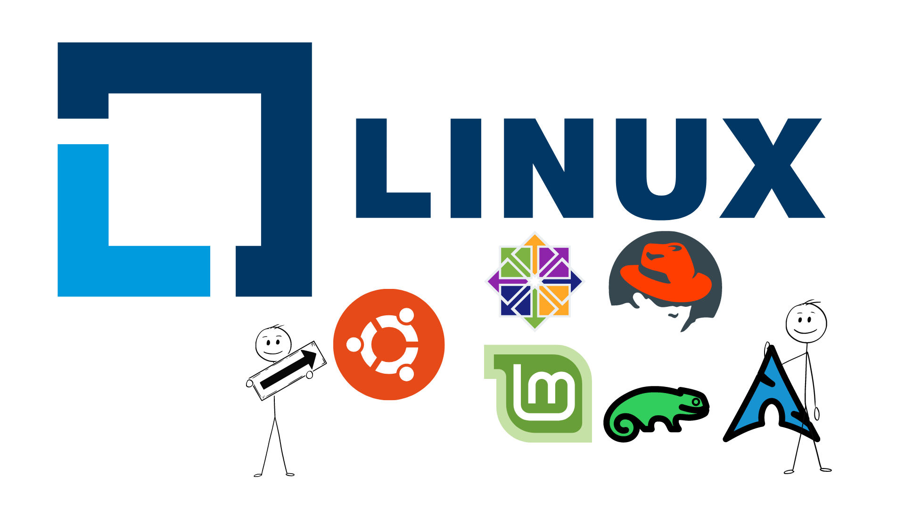

# Linux

[⚠️ Reference](https://opensource.com/resources/linux)

Linux is the best-known and most-used open source operating system. As an operating system, Linux is software that sits underneath all of the other software on a computer, receiving requests from those programs and relaying these requests to the computer’s hardware.

#### How does Linux differ from other operating systems?

In many ways, Linux is similar to other operating systems you may have used before, such as Windows, macOS (formerly OS X), or iOS. Like other operating systems, Linux has a graphical interface, and the same types of software you are accustomed to, such as word processors, photo editors, video editors, and so on. In many cases, a software’s creator may have made a Linux version of the same program you use on other systems. In short: if you can use a computer or other electronic device, you can use Linux.

But Linux also is different from other operating systems in many important ways. First, and perhaps most importantly, Linux is open source software. The code used to create Linux is free and available to the public to view, edit, and—for users with the appropriate skills—to contribute to.

Linux is also different in that, although the core pieces of the Linux operating system are generally common, there are many distributions of Linux, which include different software options. This means that Linux is incredibly customizable, because not just applications, such as word processors and web browsers, can be swapped out. Linux users also can choose core components, such as which system displays graphics, and other user-interface components.

#### Who uses Linux?

You probably already use Linux, whether you know it or not. Depending on which user survey you look at, between one- and two-thirds of the webpages on the Internet are generated by servers running Linux.

Companies and individuals choose Linux for their servers because it's secure, flexible, and you can receive excellent support from a large community of users, in addition to companies like Canonical, SUSE, and Red Hat, each of which offer commercial support.

Many devices you probably own, such as Android phones and tablets and Chromebooks, digital storage devices, personal video recorders, cameras, wearables, and more, also run Linux. Your car has Linux running under the hood. Even Microsoft Windows features Linux components, as part of the Windows Subsystem for Linux (WSL).

#### Who “owns” Linux?

By virtue of its open source licensing, Linux is freely available to anyone. However, the trademark on the name “Linux” rests with its creator, Linus Torvalds. The source code for Linux is under copyright by its many individual authors, and licensed under the GPLv2 license.

The term “Linux” technically refers to just the Linux kernel. Most people refer to the entire operating system as "Linux" because to most users an OS includes a bundle of programs, tools, and services (like a desktop, clock, an application menu, and so on). Some people, particularly members of the Free Software Foundation, refer to this collection as GNU/Linux, because many vital tools included are GNU components. However, not all Linux installations use GNU components as a part of the operating system: Android, for example, uses a Linux kernel but relies very little on GNU tools.

#### How was Linux created?
Linux was created in 1991 by Linus Torvalds, a then-student at the University of Helsinki. Torvalds built Linux as a free and open source alternative to Minix, another Unix clone that was predominantly used in academic settings. He originally intended to name it “Freax,” but the administrator of the server Torvalds used to distribute the original code named his directory “Linux” after a combination of Torvalds’ first name and the word Unix, and the name stuck.

> For Learning Learning Linux, view the Resources Section.