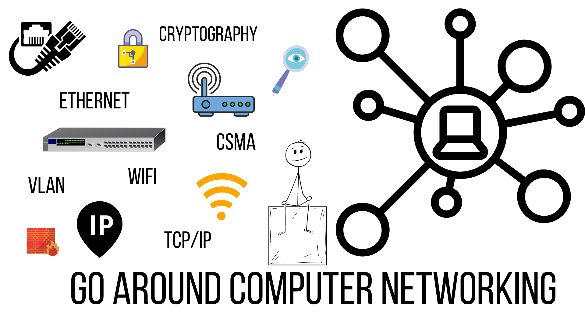

# Networking 
[⚠️ Reference](https://aws.amazon.com/what-is/computer-networking/)

Computer networking refers to interconnected computing devices that can exchange data and share resources with each other. These networked devices use a system of rules, called communications protocols, to transmit information over physical or wireless technologies.

#### How does a computer network work?
Nodes and links are the basic building blocks in computer networking. A network node may be data communication equipment (DCE) such as a modem, hub or, switch, or data terminal equipment (DTE) such as two or more computers and printers. A link refers to the transmission media connecting two nodes. Links may be physical, like cable wires or optical fibers, or free space used by wireless networks.

In a working computer network, nodes follow a set of rules or protocols that define how to send and receive electronic data via the links. The computer network architecture defines the design of these physical and logical components. It provides the specifications for the network’s physical components, functional organization, protocols, and procedures.

#### What do computer networks do?
Computer networks were first created in the late 1950s for use in the military and defense. They were initially used to transmit data over telephone lines and had limited commercial and scientific applications. With the advent of internet technologies, a computer network has become indispensable for enterprises.

Modern-day network solutions deliver more than connectivity. They are critical for the digital transformation and success of businesses today. Underlying network capabilities have become more programmable, automated, and secure.

Modern computer networks can:
**Operate virtually**
The underlying physical network infrastructure can be logically partitioned to create multiple "overlay" networks. In an overlay computer network, the nodes are virtually linked, and data can be transmitted between them through multiple physical paths. For example, many enterprise networks are overlaid on the internet.
**Integrate on a large scale**
Modern networking services connect physically distributed computer networks. These services can optimize network functions through automation and monitoring to create one large-scale, high-performance network. Network services can be scaled up or down based on demand.
**Respond quickly to changing conditions**
Many computer networks are software-defined. Traffic can be routed and controlled centrally using a digital interface. These computer networks support virtual traffic management.
**Provide data security**
All networking solutions come with in-built security features like encryption and access control. Third-party solutions like antivirus software, firewalls, and antimalware can be integrated to make the network more secure.

#### What are the types of computer network architecture?
Computer network design falls under two broad categories:

1. Client-server architecture
In this type of computer network, nodes may be servers or clients. Server nodes provide resources like memory, processing power, or data to client nodes. Server nodes may also manage client node behavior. Clients may communicate with each other, but they do not share resources. For example, some computer devices in enterprise networks store data and configuration settings. These devices are the servers in the network. Clients may access this data by making a request to the server machine.

2. Peer-to-peer architecture
In Peer-to-Peer (P2P) architecture, connected computers have equal powers and privileges. There is no central server for coordination. Each device in the computer network can act as either client or server. Each peer may share some of its resources, like memory and processing power, with the entire computer network. For example, some companies use P2P architecture to host memory-consuming applications, such as 3-D graphic rendering, across multiple digital devices.

#### What is network topology?
The arrangement of nodes and links is called network topology. They can be configured in different ways to get different outcomes. Some types of network topologies are:
Bus topology
Each node is linked to one other node only. Data transmission over the network connections occurs in one direction.
Ring topology
Each node is linked to two other nodes, forming a ring. Data can flow bi-directionally. However,single node failure can bring down the entire network.
Star topology
A central server node is linked to multiple client network devices. This topology performs better as data doesn’t have to go through each node. It is also more reliable.
Mesh topology
Every node is connected to many other nodes. In a full mesh topology, every node is connected to every other node in the network.