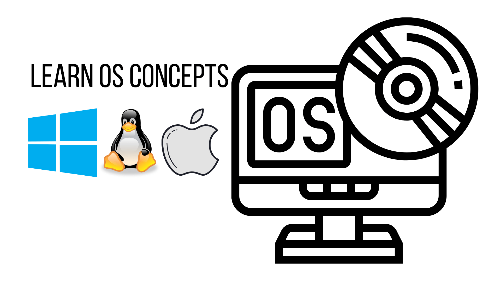

# 💻 Operating System
[⚠️ Reference](https://www.tutorialspoint.com/operating_system/index.htm)

An Operating System (OS) is an interface between a computer user and computer hardware. An operating system is a software which performs all the basic tasks like file management, memory management, process management, handling input and output, and controlling peripheral devices such as disk drives and printers.

#### Important functions of an operating System.

- Memory Management
- Processor Management
- Device Management
- File Management
- Security
- Control over system performance
- Job accounting
- Error detecting aids
- Coordination between other software and users

#### Applications of Operating System

- Security − By means of password and similar other techniques, it prevents unauthorized access to programs and data.

- Control over system performance − Recording delays between request for a service and response from the system.

- Job accounting − Keeping track of time and resources used by various jobs and users.

- Error detecting aids − Production of dumps, traces, error messages, and other debugging and error detecting aids.

- Coordination between other softwares and users − Coordination and assignment of compilers, interpreters, assemblers and other software to the various users of the computer systems.

> The above discussed are some introduction to operating System. For Learning utilize the Resources section and get familiar with the concepts.