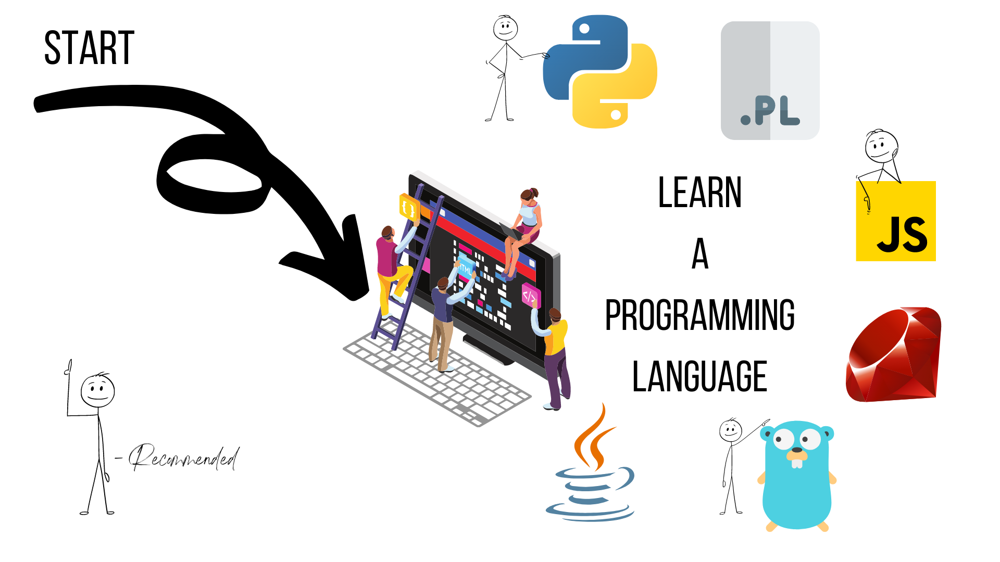

## Programming

**Programming** is the most crucial skill for a DevOps Engineer. You should have a clear understanding of different programming languages. DevOps is a combination of *programming and automation*. You should be able to write code to **automate** the process of deploying and managing your infrastructure. These are the **some of the programming languages** you should be familiar with one of them:

     
 
>Click one of the above icons to see the resources and excersises for that language.

**Note**:
    DevOps Environment is not limited to the above programming languages. You can use any programming language to build your DevOps Environment. It varies as per the requirements of your project. 

### [Operating Systems &#8594;]()