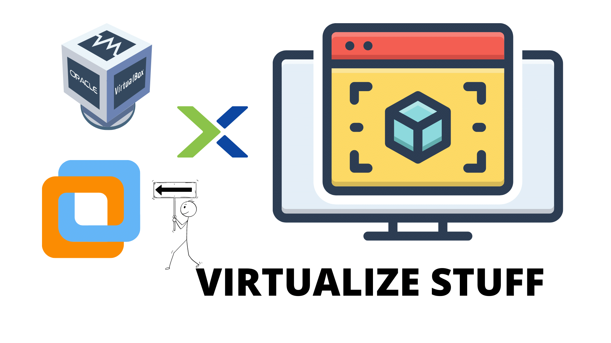

# 🦠️ Virtualzation

[⚠️ Reference](https://www.vmware.com/in/solutions/virtualization.html)

A virtual computer system is known as a “virtual machine” (VM): a tightly isolated software container with an operating system and application inside. Each self-contained VM is completely independent. Putting multiple VMs on a single computer enables several operating systems and applications to run on just one physical server, or “host.”
A thin layer of software called a “hypervisor” decouples the virtual machines from the host and dynamically allocates computing resources to each virtual machine as needed.

#### Key Properties of Virtual Machines

**Partitioning**
- Run multiple operating systems on one physical machine.
- Divide system resources between virtual machines.

**Isolation** 
- Provide fault and security isolation at the hardware level.
- Preserve performance with advanced resource controls.

**Encapsulation**
- Save the entire state of a virtual machine to files.
- Move and copy virtual machines as easily as moving and copying files.

**Hardware Independence**
- Provision or migrate any virtual machine to any physical server.

> The above discussed are some introduction to virtualization. For Learning utilize the Resources section and get familiar with the concepts.